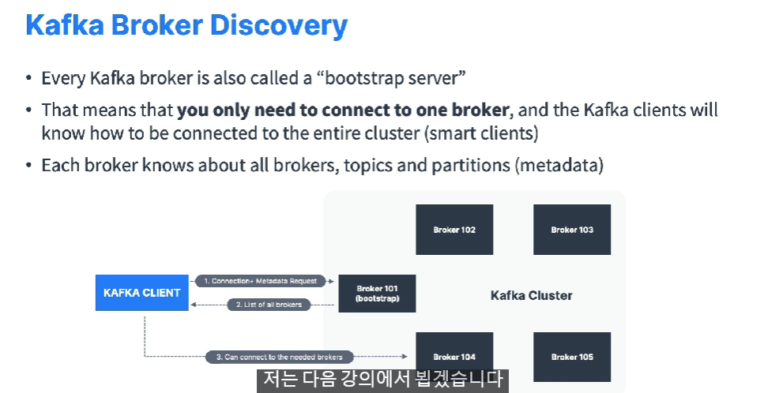

# Section1

## 소개

### 장점

- 시스템 전부를 끄지않아도 카프카를 업그레이드 하거나 정비할 수 있다.
- 수평적 확장이 용이

### Use Cases

- Messaging System
- Activity Tracking
- Gather metrics from many different locations
- Applications Logs gathering
- Stream processing (with the Kafka Streams API for example)
- De-coupling of system dependencies
- Intergration with Spark, Flink, Storm, Hadoop and many other Big Data technologies
- Micro-services pub/sub

- kafka is only used as a tranportaion mechanism

# Section4 카프카이론

## Kafka Topics

### Topics :

- 데이터 스트림

- 데이터 테이블과 같은 것

- 토픽에 모든 것을 보낼 수 있음

  - 데이터 검증이 없기 때문에

- 이름으로 구분 

- 모든 종류의 메세지 포맷을 받음

  - 바이너리, json 

- 메세지의 순서들을 데이터 스트림이라 부름

  - 그래서 카프카를 스트리밍 플랫폼이라 부름

- 토픽에 쿼리를 보낼 수 없음 Producers를 통해 토픽에 데이터를 전달할 수 있다. Consumers를 통해 데이터를 읽을 수 있음.

- 토픽은 partitions으로 구분할 수 있다. 

- 토픽으로 간 데이터는 임의의 파티션에 저장되고, 각 파티션안에서 메세지들은 순서가 정해진다.

- 파티션의 메세지들은 각각 id값을 가지고 있다.

  - 이 id를 파티션 offset이라 부른다.

    

- 카프카 토픽들은 불변이다.
  - 데이터가 파티션에 기록되면 이 것을 바꿀 수 없다.

- 토픽의 데이터를 보관하는데 제한시간이 있다(기본 1주)

## Producers

- 데이터를 토픽에 기록하는 기능
- 프로듀서는 데이터 키(json, 바이너리, String 등)를 정할 수 있다.

- if key = null, data is sent round robin (partition0, then 1, then 2) 
  - 라운드로빈 : 데이터가 토픽안에 파티션안에 분산된다는 의미
- if key = null, then all messages for that key will always go to the same partition (hashing)
- 카프카는 키에 맞게 자동으로 해당 파티션으로 분류한다.

### Message Serialiser

- 메세지를 바이트로 바꾸는 것 

- 시리얼 라이져 로직

- A kafka partitioner is a code logic that takes a record and determines to which partition to send it into.

## Consumers

- 컨슈머는 Kafka 브로커(서버)에 데이터를 요청하고 응답을 받는다.

- 컨슈머는 어떤 브로커를 통해 읽어야 할지 자동으로 알고 있다.
- 컨슈머는 브로커가 실패했을 때 어떻게 복구하는지 알고 있다.

### Consumer Deserializer

- 바이트로 된 데이터를 읽으려면 디시리얼라이져를 거쳐야함

  

- 토픽의 자료형을 바꾸고 싶으면 새로운 토픽을 만들어야 한다.

### Consumer Groups

- 각각 컨슈머 그룹을 만들어 준다.

### Consumer Offsets

### Delivery semantics for consumers

## Broker

- 카프카 클러스터는 여러개의 브로커를 가지고 있다. 브로커는 서버를 의미함

## 토픽 복제

- 토픽의 복제계수는 1이상 일반적으로 2 또는 3
- 브로커가 다운되면 다른 브로커가 서버역할을 할 수 있다.
- 

### 파티션 리더

- 하나의 파티션이 브로커 안에 리더가 될 수 있다.
- Producers는 브로커의 오직 한 리더 파티션에 데이터를 전송할 수 있다.

- Consumer는 리더파티션만 읽는다.

- 카프카로 네트워크 비용을 낮출 수 있다.

- 레이턴시 낮출 수 있다.

## 프로듀서 확인

- 프로듀서는 카프카 브로커로 부터 데이터가 쓰여졌다는걸 확인 받을 수 있다.

## 토픽 내구성

## 주키퍼

- 앞으로 대체될 예정 

- 주키퍼는 카프카보다 불안정해서 안쓰이는 추세 kip-500 

## 복습

- 토픽에 데이터를 생성하기 위해 프로듀서가 카프카 클라이언트에 제공해야 하는 것은?

  - 클러스터의 브로커, 토픽 이름

  - 매우 중요: 브로커 하나에만(어떤 브로커든) 연결하고, 쓰고 싶은 토픽 이름만 제공하면 됩니다. 카프카 클라이언트가 데이터를 적당한 브로커와 파티션으로 라우팅해 줍니다!

- 토픽에서 데이터를 읽기 위해 컨슈머가 필요한 구성은?
  - 연결할 브로커, 토픽 이름
  - 매우 중요: 브로커 하나에만(어떤 브로커든) 연결하고, 읽어 오고 싶은 토픽 이름만 제공하면 됩니다. 카프카가 호출을 적당한 브로커와 파티션으로 라우팅해 줍니다!

